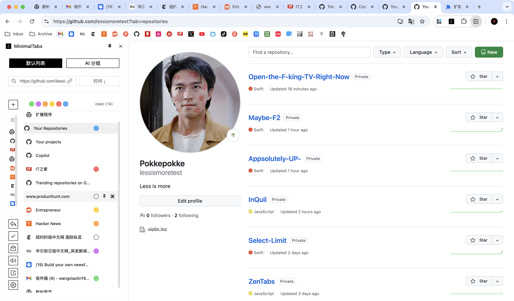
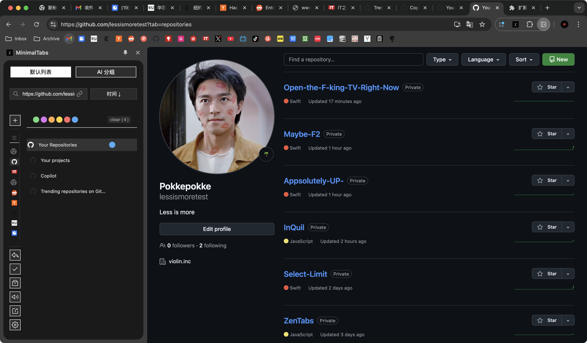

# MinimalTabs - 极简标签页管理器

  

**写在前：
本项目所有代码及文档由有 cursor 编写，由于代码已成屎山😂，改起来实在费时间，很多功能和想法受限，readme 文档 99% 也是 ai 生成，有的功能根本没有，连最基本的右键菜单都很难靠和cursor对话加上去了，icon截图也不是最终版，不过也懒得改了，就先这样凑活用吧😂。
对了，AI 分组功能需要自备api key。另请勿用于商业用途，仅供学习交流。**

MinimalTabs 是一个简洁优雅的 Chrome 标签页管理器，专注于提供流畅的用户体验和高效的标签页管理功能。无论是日常浏览还是工作研究，都能帮助你更好地组织和管理浏览器标签页。

## 📸 应用截图

  
  
<em>默认列表界面</em>

   
  
<em>筛选icon界面</em>

## ✨ 主要特性

- 🎯 **智能分组** 
  - 按域名自动分组
  - AI 智能分组（基于标签页内容相似度，gemini和deepseek模型均支持）
  - 自定义分组规则
  
- 📌 **标签管理**
  - 标签页置顶功能
  - 批量关闭标签
  - 标签页排序（按标题、创建时间、最后打开时间）
  - 标签页预览
  - 归档标签页：将不常用的标签页归档，保持界面整洁
  - 恢复标签页：从归档中恢复标签页
  - 会话恢复：从会话中恢复标签页

- 🔀 **快捷操作**
  - 快捷切换：使用快捷键或按钮快速切换标签页
  - 清除按钮：一键清除所有标签页的颜色标记
  
- 🔍 **搜索功能**
  - 实时搜索（支持快捷键 Ctrl/Cmd + F）
  - 支持标题和网址搜索
  - 搜索历史记录
  - 模糊匹配
  
- 🎨 **颜色标签**
  - 7 种预设颜色（红、橙、黄、绿、蓝、紫、灰）
  - 一键添加/移除颜色标记
  - 颜色标签持久化存储
  - 颜色筛选器
  
- 🔄 **同步与备份**
  - 实时自动同步
  - Chrome 账号同步支持
  - 本地存储备份
  - 配置导入/导出
  
- 📱 **界面设计**
  - 响应式布局，适配各种屏幕
  - 支持侧边栏模式
  - 深色/浅色主题切换
  - 简约现代的 UI 设计
  
- 🔗 **扩展功能**
  - 批量复制标签页链接
  - 一键分享标签组
  - 快捷键支持
  - 标签页休眠管理

## 🚀 使用方法

1. 安装方式：
   - 通过 Chrome 网上应用店安装
   - 下载 Release 版本手动安装
   
2. 基础操作：
   - 点击浏览器工具栏的扩展图标打开管理器
   - 使用侧边栏模式：右键点击扩展图标 -> "在侧边栏中打开"
   - 使用 Ctrl/Cmd + F 快速搜索标签页
   
3. 标签管理：
   - 点击标签页右侧按钮添加颜色标记
   - 拖拽标签页进行排序
   - 右键标签页查看更多操作选项
   - 使用归档功能将不常用的标签页归档
   - 从归档中恢复标签页
   - 使用左侧恢复按钮从会话中恢复标签页
   
4. 快捷键：
   - `Ctrl/Cmd + F`: 搜索
   - `Ctrl/Cmd + B`: 打开/关闭侧边栏
   - `Ctrl/Cmd + D`: 切换深色模式
   - `Ctrl/Cmd + S`: 保存当前标签组
   - `Ctrl/Cmd + 数字`: 快速切换标签页

## 🛠️ 技术栈

- 前端：HTML5, CSS3, JavaScript (ES6+)
- 存储：Chrome Storage API
- 构建工具：Webpack
- 代码规范：ESLint
- 模型：gemini和deepseek模型均支持

## 📋 开发计划

近期计划:
- [ ] 支持自定义颜色标签
- [ ] 添加标签页备注功能
- [ ] 标签组导出为 Markdown
- [ ] 优化搜索算法
- [ ] 添加标签页预览功能
- [ ] 支持更多快捷键
- [ ] 添加数据分析功能
- [ ] 支持分组
- [ ] 支持标签页休眠
- [ ] 支持分组展开收起状态同步chrome分组
- [ ] 支持自动分组策略优化
- [ ] 支持手动分组
- [ ] 支持右键菜单

长期计划:
- [ ] 引入机器学习分类
- [ ] 支持更多快捷键
- [ ] 添加数据分析功能
- [ ] 支持云端备份
- [ ] 多语言支持

## 🤝 贡献指南

1. Fork 项目
2. 创建特性分支 (`git checkout -b feature/AmazingFeature`)
3. 提交更改 (`git commit -m 'Add some AmazingFeature'`)
4. 推送到分支 (`git push origin feature/AmazingFeature`)
5. 提交 Pull Request

## 🐛 问题反馈

如果你发现了 bug 或有新功能建议，欢迎提交 Issue。提交时请：
- 清晰描述问题或建议
- 提供复现步骤（如果是 bug）
- 附上相关的截图或错误信息

## 📄 开源协议

MIT License - 查看 [LICENSE](LICENSE) 文件了解更多详情

## 📧 联系方式

- 项目主页：[GitHub](https://github.com/yourusername/MinimalTabs)
- 问题反馈：[Issue 页面](https://github.com/yourusername/MinimalTabs/issues)
- 电子邮件：your.email@example.com

---

**MinimalTabs** - 让标签管理更简单、更高效 ✨